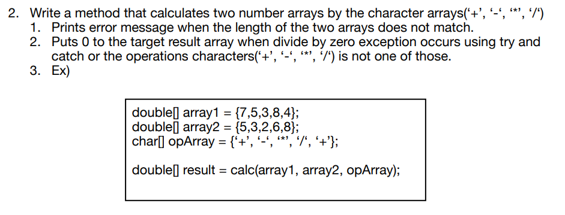
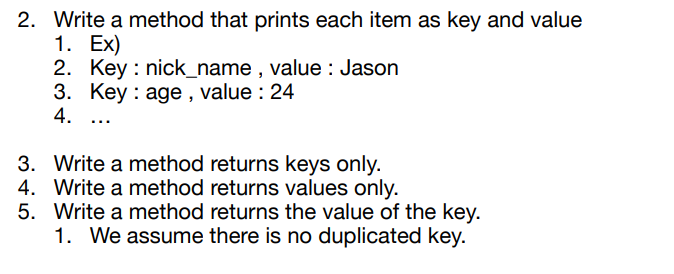

# Object-Oriented-Programming
Object Oriented Programming through Java

Q1. Creating methods
---------------------

Q2. Creating Key-Value class which stores the data of person
-------------------------------------------------------------

Q3. Creating Matrix class includes some methods related to it
-------------------------------------------------------------

